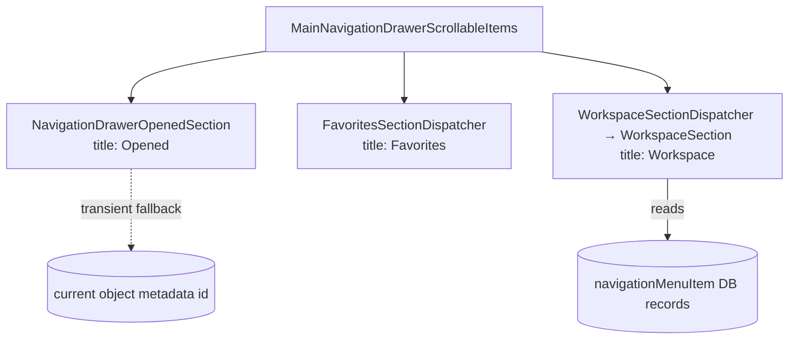
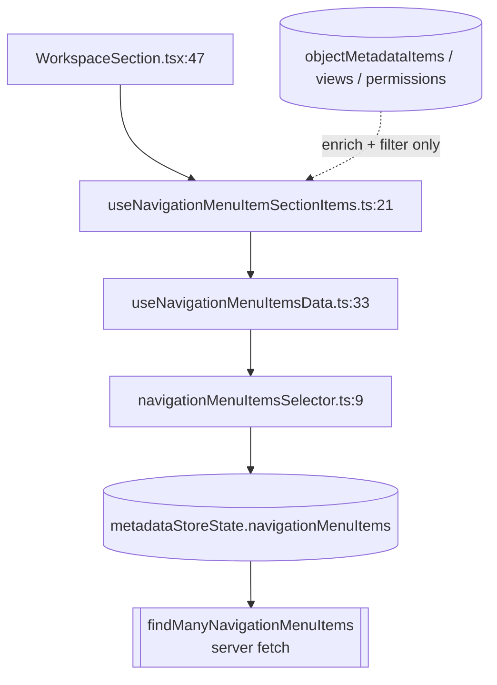
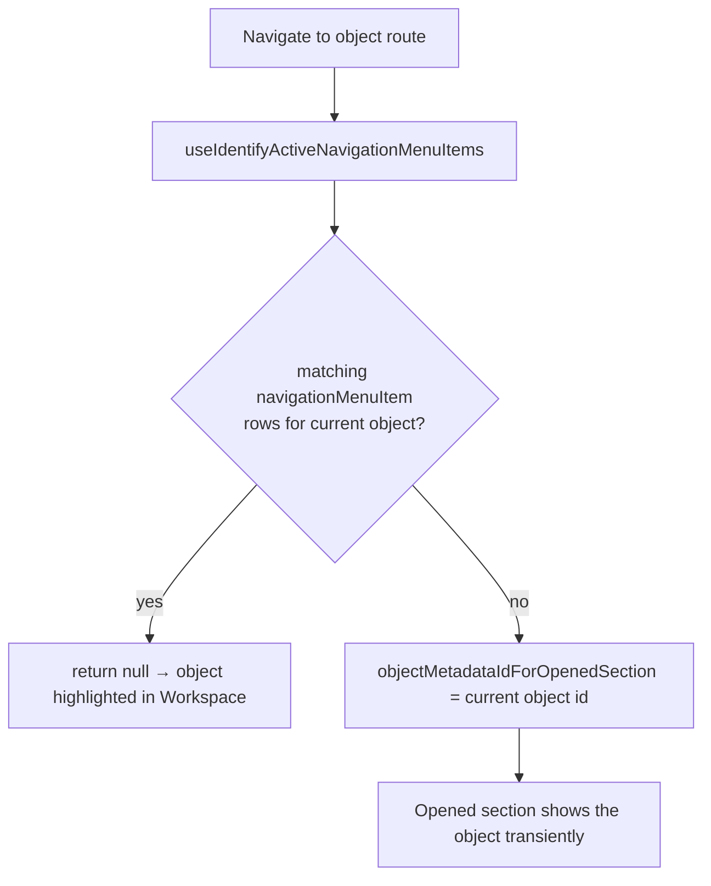
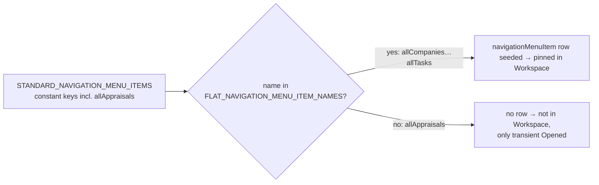
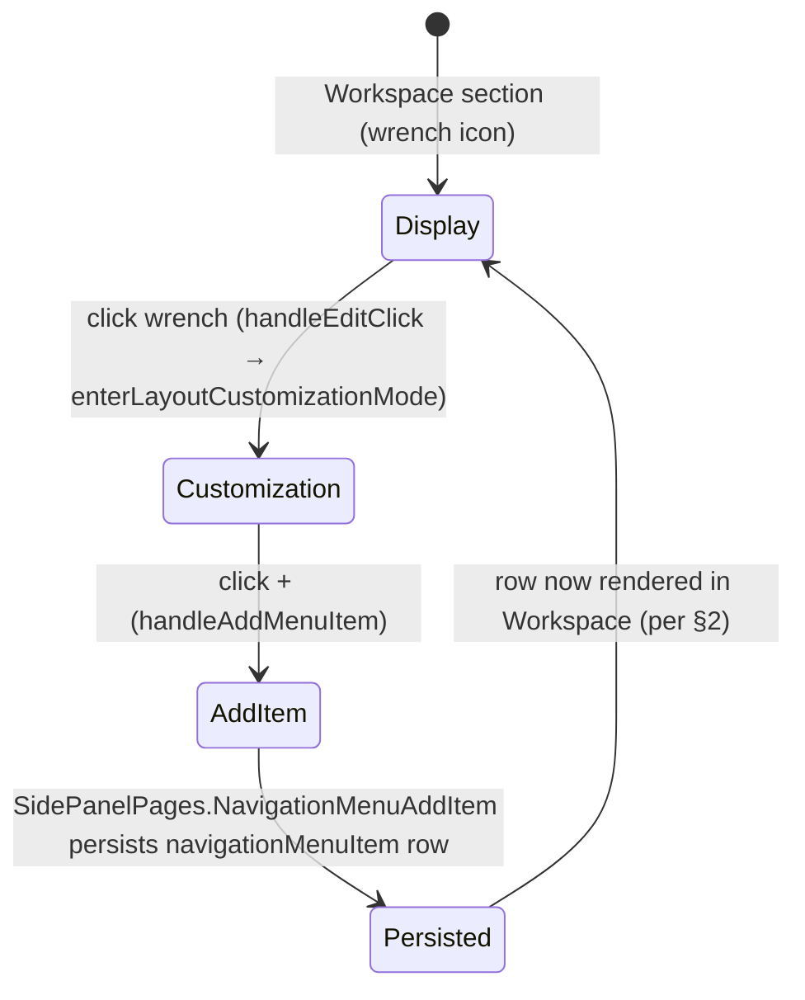

# Navigation Sidebar Sections (Opened / Favorites / Workspace)

<!--
  Diagnosis cache for the Twenty fork left-navigation sidebar.
  Explains WHICH data source drives each sidebar section and WHY a new
  standard object (e.g. `appraisal`) is reachable but not pinned in "Workspace".
  Cross-tree cache: primary scope is twenty-front/navigation-menu-item, with
  supporting sources in twenty-front/navigation (the drawer) and twenty-server
  (the seed that materializes default nav rows).
-->

---
chunking: dxNAVSEC
doc-meta:
  commit: b91c2a6457
sources:
  - folder: packages/twenty-front/src/modules/navigation-menu-item/
    prefix: NMI
    type: raw
  - folder: packages/twenty-front/src/modules/navigation/
    prefix: NAV
    type: raw
  - folder: packages/twenty-server/src/engine/workspace-manager/twenty-standard-application/
    prefix: SVR
    type: raw
---

<!--dxNAVSEC00001:NAV#31&NAV#34&NAV#37-->
## 1. Sidebar composition and section render order

The scrollable body of the left navigation drawer renders **three sections in a
fixed order — Opened, Favorites, Workspace** — in
`modules/navigation/components/MainNavigationDrawerScrollableItems.tsx`
(`NAV#32`-`NAV#38`):

```tsx
<StyledScrollableItemsContainer>
  <NavigationDrawerOpenedSection />          // NAV#34  → "Opened"
  <Suspense fallback={…}>
    <FavoritesSectionDispatcher />           // NAV#36  → "Favorites"
    <WorkspaceSectionDispatcher />           // NAV#37  → "Workspace"
  </Suspense>
</StyledScrollableItemsContainer>
```

`FavoritesSectionDispatcher` and `WorkspaceSectionDispatcher` are lazy-loaded
(`NAV#9`-`NAV#23`); the Opened section renders eagerly. Each section is driven by
a **different data source**, which is the key to understanding why an object can
appear in one place but not another:

| Section   | Component                          | Backing data                                                        |
|-----------|------------------------------------|---------------------------------------------------------------------|
| Opened    | `NavigationDrawerOpenedSection`    | Transient: current object id, only as a *fallback* (see §3)         |
| Favorites | `FavoritesSectionDispatcher`       | Favorite records (out of scope for this cache)                      |
| Workspace | `WorkspaceSectionDispatcher` → `WorkspaceSection` | `navigationMenuItem` **DB records** (see §2)         |


<!--/dxNAVSEC00001:NAV#31&NAV#34&NAV#37-->

<!--dxNAVSEC00002:NMI#47&NMI#22&NMI#9-->
## 2. "Workspace" section is driven by `navigationMenuItem` DB records

The Workspace section lists whatever `navigationMenuItem` rows exist for the
workspace. It is **not** derived from object metadata — object metadata only
*enriches and filters* those rows. **No nav-item row ⇒ the object is not in
"Workspace"**, even if the object is fully defined and browsable elsewhere.

Data path (top → bottom):

1. `display/sections/workspace/components/WorkspaceSection.tsx:47` calls
   `useNavigationMenuItemSectionItems()` and passes the result as `items` to
   `WorkspaceSectionContainer` (`WorkspaceSection.tsx:182`-`185`, title
   `t\`Workspace\``).
2. `display/hooks/useNavigationMenuItemSectionItems.ts:21`-`22` pulls
   `workspaceNavigationMenuItems` from `useNavigationMenuItemsData()`, then runs
   them through `getWorkspaceSidebarOrphanItemsInDisplayOrder` +
   `flattenNavigationMenuItemsWithFolderChildren` (`NMI` L33-45). Object
   metadata, views and object permissions are passed in here purely to
   **enrich/filter/order** — they never *add* items.
3. `display/hooks/useNavigationMenuItemsData.ts:18`-`48` reads the raw rows from
   `navigationMenuItemsSelector` (`NMI` L21), splits them into user-scoped vs
   workspace-scoped via `filterWorkspaceNavigationMenuItems` (`NMI` L33-39). In
   layout-customization mode it swaps in the draft (`navigationMenuItemsDraft`).
4. `common/states/navigationMenuItemsSelector.ts:9`-`11` reads
   `metadataStoreState`'s `navigationMenuItems` entry — i.e. the rows fetched
   from the server via `findManyNavigationMenuItems`.



**Consequence:** a standard object with no `navigationMenuItem` row is absent
from "Workspace" regardless of its metadata. Materializing a row happens either
at seed time (§4) or at runtime via the pin flow (§5).
<!--/dxNAVSEC00002:NMI#47&NMI#22&NMI#9-->

<!--dxNAVSEC00003:NMI#13&NMI#140&NMI#173-->
## 3. "Opened" section is a transient single-item fallback

`display/sections/components/NavigationDrawerOpenedSection.tsx:8`-`32` renders a
**single object** section titled `t\`Opened\`` (`NMI` L27). Its content is one
`objectMetadataItem` looked up by `objectMetadataIdForOpenedSection`
(`NavigationDrawerOpenedSection.tsx:13`-`18`); if that id is undefined the whole
section renders `null` (`NMI` L20-22).

`objectMetadataIdForOpenedSection` comes from
`display/hooks/useIdentifyActiveNavigationMenuItems.ts:18`-`192`. This hook is
**URL/route-driven** (`useLocation`, `useParams`, current view id) and its result
is a `useMemo` recomputed on every navigation — nothing is persisted. The id is
set to the current object's id **only when the current object has zero matching
`navigationMenuItem` records**:

- Record-show page branch (`NMI` L102-144): returns
  `objectMetadataIdForOpenedSection: currentObjectMetadataItem?.id` only when
  `activeNavigationMenuItemIds.length === 0` (`NMI` L140-142).
- Default (list/other) branch (`NMI` L162-177): returns the current object's id
  only when `matchingObjectNavigationMenuItemIds.length === 0 && isDefined(currentObjectMetadataItem)`
  (`NMI` L173-176).
- If a matching nav-item exists (last-clicked relevant, matching view, or
  matching object/record item), it returns `objectMetadataIdForOpenedSection: null`
  (`NMI` L94-97, L155-159, L170-172) — so the object shows as *active in
  Workspace* instead of appearing in "Opened".



So "Opened" is the escape hatch for objects that are reachable/viewable but
**not pinned** in Workspace — it surfaces the current object only while you are
on its route, and disappears once you navigate away.
<!--/dxNAVSEC00003:NMI#13&NMI#140&NMI#173-->

<!--dxNAVSEC00004:SVR#15&SVR#48&SVR#5-->
## 4. Server seeds default Workspace nav via a hardcoded allowlist

Default Workspace nav rows are materialized by the Twenty Standard Application
flat-entity sync in
`twenty-server/.../twenty-standard-application/utils/navigation-menu-item/build-standard-flat-navigation-menu-item-maps.util.ts`.
The critical detail: the builder iterates a **hardcoded allowlist**
`FLAT_NAVIGATION_MENU_ITEM_NAMES` (`SVR` L15-22), **not** the keys of the
`STANDARD_NAVIGATION_MENU_ITEMS` constant:

```ts
const FLAT_NAVIGATION_MENU_ITEM_NAMES = [
  'allCompanies', 'allDashboards', 'allNotes',
  'allOpportunities', 'allPeople', 'allTasks',
] as const;                                          // SVR L15-22

for (const navigationMenuItemName of FLAT_NAVIGATION_MENU_ITEM_NAMES) {  // SVR L48
  const def = STANDARD_NAVIGATION_MENU_ITEMS[navigationMenuItemName];
  … createStandardNavigationMenuItemFlatMetadata(…)   // materializes a row
}
```

Only names in that array produce a `navigationMenuItem` row (plus the Workflows
folder + its items, `SVR` L74-115). The constant
`constants/standard-navigation-menu-item.constant.ts:5`-`87` can define **more**
entries than the allowlist iterates.

**The `appraisal` gap (verified in-tree):** the constant already contains
`allAppraisals` (`SVR` L48-54, position 7) — but `allAppraisals` is **absent**
from `FLAT_NAVIGATION_MENU_ITEM_NAMES`. Therefore no `navigationMenuItem` row is
seeded for it, so per §2 it never appears in "Workspace". The object is still
reachable/viewable (its metadata + views exist), which per §3 makes it surface
transiently in "Opened" when you visit its route.

> **Rule of thumb:** adding an entry to `STANDARD_NAVIGATION_MENU_ITEMS` is
> **necessary but not sufficient** to pin a standard object. The name must
> **also** be added to `FLAT_NAVIGATION_MENU_ITEM_NAMES` in the build util for a
> row to materialize at seed time.


<!--/dxNAVSEC00004:SVR#15&SVR#48&SVR#5-->

<!--dxNAVSEC00005:NMI#73&NMI#172&NMI#186-->
## 5. Per-workspace runtime pinning (wrench → + → Add item)

Beyond seed-time defaults, a workspace can pin items at runtime through the
layout-customization flow in `WorkspaceSection.tsx`:

1. When not in customization mode, the section's right icon is the **wrench**
   (`IconTool`, `NMI` L196-203); `handleEditClick` (`WorkspaceSection.tsx:73`-`76`)
   calls `enterLayoutCustomizationMode()`.
2. In customization mode the right icon becomes a **`+`** (`IconPlus`, `NMI`
   L188-194); `handleAddMenuItem` (`WorkspaceSection.tsx:172`-`180`) navigates
   the side panel to `SidePanelPages.NavigationMenuAddItem`.
3. Adding an item there persists a `navigationMenuItem` **OBJECT** row scoped to
   that workspace, which then flows back through the §2 data path and appears in
   "Workspace".

This is the supported way to pin a standard object (such as `appraisal`) that
the seed allowlist omits, without editing server code — the pin is per-workspace
runtime state, not a code default.


<!--/dxNAVSEC00005:NMI#73&NMI#172&NMI#186-->
