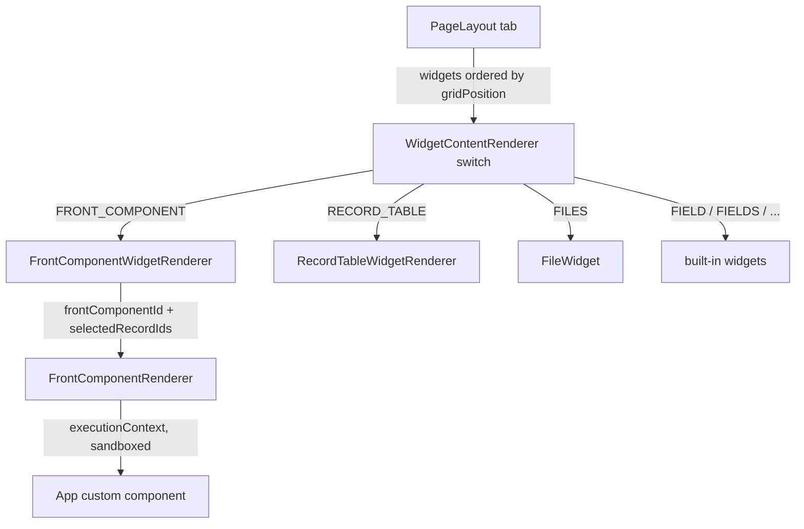
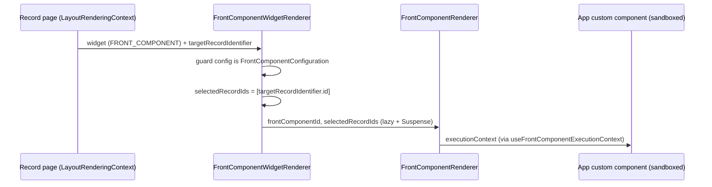

# Page Layout Widgets — rendering subsystem & custom-UI insertion

<!--dxPLW00001:PLW&GQL#6307-->
## Overview

A Twenty record page is composed of **page-layout widgets**. Each widget is a
`PageLayoutWidget` whose `type` is a value of the `WidgetType` GraphQL enum. The
front-end resolves that enum to a concrete React renderer via a single `switch`
in `WidgetContentRenderer` (`page-layout/widgets/components/WidgetContentRenderer.tsx`).
This is the seam an **app** uses to inject its own UI: it authors a page layout
whose tab holds a `FRONT_COMPONENT` widget (its custom component, e.g. a photo
carousel) placed — via `gridPosition` — above or beside the built-in
`RECORD_TABLE` / field widgets.

Two directions meet here:
- **Runtime rendering** (this front-end module): enum → renderer dispatch,
  `FrontComponentWidgetRenderer` bridging record context into the sandboxed
  custom component, `FileWidget` → `FilesCard`, `RecordTableWidget`.
- **Authoring** (twenty-sdk `define/`): `definePageLayout` / `defineFrontComponent`
  and the `PageLayoutWidgetManifest` / `PageLayoutManifest` shapes an app ships.


<!--/dxPLW00001:PLW&GQL#6307-->

<!--dxPLW00002:GQL#6307&PLW-->
## WidgetType taxonomy and renderer map

`WidgetType` is a GraphQL enum (`generated-metadata/graphql.ts`, enum declared at
line 6307). `WidgetContentRenderer.tsx` maps each value to a renderer; any value
with no `case` falls through to the `default` returning `null`.

| WidgetType | Renderer component (in `WidgetContentRenderer.tsx` switch) |
|------------|-----------------------------------------------------------|
| `GRAPH` | `GraphWidgetRenderer` |
| `IFRAME` | `IframeWidget` |
| `FIELD` | `FieldWidget` |
| `FIELDS` | `FieldsWidget` |
| `FIELD_RICH_TEXT` | `FieldRichTextWidgetRenderer` |
| `STANDALONE_RICH_TEXT` | `StandaloneRichTextWidgetRenderer` |
| `TIMELINE` | `TimelineWidget` |
| `TASKS` | `TaskWidget` |
| `NOTES` | `NoteWidget` |
| `FILES` | `FileWidget` → `FilesCard` |
| `EMAILS` | `EmailWidget` |
| `EMAIL_THREAD` | `EmailThreadWidget` |
| `CALENDAR` | `CalendarWidget` |
| `WORKFLOW` | `WorkflowWidget` |
| `WORKFLOW_VERSION` | `WorkflowVersionWidget` |
| `WORKFLOW_RUN` | `WorkflowRunWidget` |
| `FRONT_COMPONENT` | `FrontComponentWidgetRenderer` (app custom UI) |
| `RECORD_TABLE` | `RecordTableWidgetRenderer` |
| `VIEW` | (enum value exists; no `case` in the switch → `default` `null`) |

Notes:
- The enum carries `VIEW`, but `WidgetContentRenderer` has no `VIEW` case — it is
  not wired into this record-page switch (`RECORD_TABLE` is the table renderer used).
- The dispatch is `switch (widget.type)` — pure enum → component, no config
  branching at this layer. Per-widget config lives on `widget.configuration`
  (a discriminated union keyed by `configurationType`).
- `FRONT_COMPONENT` and `RECORD_TABLE` are the two that matter for an app that
  wants to combine its own UI with the standard record table on one page.
<!--/dxPLW00002:GQL#6307&PLW-->

<!--dxPLW00003:PLW&FCR-->
## FrontComponentWidgetRenderer — bridging CRM record context into custom UI

`page-layout/widgets/front-component/components/FrontComponentWidgetRenderer.tsx`
is the record-page adapter for a `FRONT_COMPONENT` widget. Given a
`PageLayoutWidget`, it:

1. Reads editing/layout state — `useIsPageLayoutInEditMode()`,
   `usePageLayoutContentContext()` (for `layoutMode`) — to set container
   `overflow` (visible for `CANVAS` layout, else `auto`) and disable
   `pointer-events` while in edit mode (`StyledContainer`).
2. Pulls the current record from `useLayoutRenderingContext()` →
   `targetRecordIdentifier`. **This is the record-context bridge**: the layout
   rendering context knows which record the page is showing.
3. Validates `widget.configuration` is a `FrontComponentConfiguration` via
   `isWidgetConfigurationOfType(configuration, 'FrontComponentConfiguration')`;
   if not defined / wrong type it renders `PageLayoutWidgetNoDataDisplay`.
4. Extracts `frontComponentId = configuration.frontComponentId`.
5. Computes `selectedRecordIds`: if `targetRecordIdentifier?.id` is defined,
   `[targetRecordIdentifier.id]`, else `undefined`. On a record page this is a
   **single-element array of the current record's id** — the mechanism by which
   the app's component learns "which record am I mounted on".
6. Renders `<FrontComponentRenderer frontComponentId=… selectedRecordIds=… />`
   inside `<Suspense>`; `FrontComponentRenderer` is `lazy()`-imported from
   `@/front-components/components/FrontComponentRenderer`.

So the appraisal carousel example works like this: the app publishes a front
component; a page-layout widget of type `FRONT_COMPONENT` references it by
`frontComponentId`; when a Property/Appraisal record page renders, this adapter
feeds the current record id in as `selectedRecordIds` and the component fetches
its own data (e.g. photo artifacts) for that record.


<!--/dxPLW00003:PLW&FCR-->

<!--dxPLW00004:FCR-->
## FrontComponentRenderer — from id to sandboxed component

`front-components/components/FrontComponentRenderer.tsx` takes
`{ frontComponentId, selectedRecordIds }`. It queries the front-component record
by `id`, then in its content component:

- Destructures `{ id, applicationId, usesSdkClient }` from the fetched front
  component.
- Builds an execution context with
  `useFrontComponentExecutionContext({ frontComponentId, commandMenuItemId, selectedRecordIds, colorScheme })`
  — this is where `selectedRecordIds` is threaded into the sandboxed component's
  runtime `executionContext` / `frontComponentHostCommunicationApi`.
- Resolves the built component bundle URL via `getFrontComponentUrl({ frontComponentId, checksum })`
  and (if `usesSdkClient`) SDK-client URLs via `getSdkClientUrls(applicationId, …)`.
- Requires an `applicationTokenPair`; once present and the SDK client is ready it
  renders `SharedFrontComponentRenderer` inside `FrontComponentRendererProvider`,
  passing the access token + component URL.

The app's component therefore runs sandboxed (loaded from a built bundle URL,
scoped by application token), receiving the record ids as part of its execution
context rather than as raw React props from the CRM tree.
<!--/dxPLW00004:FCR-->

<!--dxPLW00005:PLW&RTW-->
## FILES widget and RECORD_TABLE widget

**FILES** — `page-layout/widgets/files/components/FileWidget.tsx`. Thin adapter:
ignores the widget payload (`widget: _widget`), reads `isInSidePanel` from
`useLayoutRenderingContext()`, and renders `<FilesCard />` wrapped in a
`SidePanelProvider` so the standard Files activity card (attachments for the
current record) shows as a page-layout widget. This is the FILES-field →
`FilesCard` path.

**RECORD_TABLE** — dispatched to `RecordTableWidgetRenderer`
(`page-layout/widgets/record-table/`), which ultimately renders
`object-record/record-table-widget/components/RecordTableWidget.tsx`.
`RecordTableWidget`:
- Pulls `{ objectNameSingular, recordIndexId, viewBarInstanceId }` from
  `useRecordIndexContextOrThrow()` (must be inside a record-index context —
  supplied by the record-table-widget provider/effects in the same folder:
  `RecordTableWidgetProvider`, `RecordTableWidgetContextStoreInitEffect`,
  `RecordTableWidgetViewLoadEffect`).
- Renders `RecordTableWidgetSetReadOnlyColumnHeadersEffect` (defaults
  `isReadOnly = true`, `isEmptyStateHidden = false`), `RecordIndexTableContainerEffect`,
  and `RecordTableWithWrappers` inside a bordered `StyledTableContainer`.

For the "custom UI above the table" goal: the table is just another widget
(`RECORD_TABLE`) in the same tab; a `FRONT_COMPONENT` widget placed at an earlier
`gridPosition.row` renders above it.
<!--/dxPLW00005:PLW&RTW-->

<!--dxPLW00006:SDK#650&SDK#1061-->
## Widget ordering & placement — gridPosition

Both the runtime `PageLayoutWidget` and the authoring `PageLayoutWidgetManifest`
carry a `gridPosition` (SDK `GridPosition`, `twenty-sdk/dist/define/index.d.ts`
line 650):

```ts
type GridPosition = {
  row: number;
  column: number;
  rowSpan: number;
  columnSpan: number;
};
```

- `row` / `column` — the widget's top-left cell (ordering: lower `row` renders
  higher on the page; within a row, lower `column` is further left).
- `rowSpan` / `columnSpan` — how many grid cells it occupies (height / width).

To place a custom carousel spanning the full width above the record table, give
the `FRONT_COMPONENT` widget a small `row` (e.g. 0) with a wide `columnSpan`, and
give the `RECORD_TABLE` widget a larger `row`. The grid geometry — not array
order — determines visual placement, so ordering is stable regardless of how the
`widgets[]` array is written. `gridPosition` is optional in the manifest; layouts
may rely on defaults when omitted.
<!--/dxPLW00006:SDK#650&SDK#1061-->

<!--dxPLW00007:SDK#1061&SDK#1077&SDK#769-->
## Authoring — PageLayoutManifest / PageLayoutWidgetManifest

From `twenty-sdk/dist/define/index.d.ts`. A page layout is a tree
`PageLayout → tabs[] → widgets[]`:

```ts
// line 1077
type PageLayoutManifest = SyncableEntityOptions & {
  name: string;
  type: string;                              // PageLayoutType
  objectUniversalIdentifier?: string;        // which object this layout is for
  defaultTabToFocusOnMobileAndSidePanelUniversalIdentifier?: string;
  tabs?: PageLayoutTabManifest[];
};

// line 1069
type PageLayoutTabManifest = SyncableEntityOptions & {
  title: string;
  position: number;
  icon?: string;
  layoutMode?: PageLayoutTabLayoutMode;      // e.g. CANVAS
  widgets?: PageLayoutWidgetManifest[];
  pageLayoutUniversalIdentifier?: string;
};

// line 1061
type PageLayoutWidgetManifest = SyncableEntityOptions & {
  title: string;
  type: string;                              // must match a WidgetType value
  objectUniversalIdentifier?: string;
  conditionalDisplay?: PageLayoutWidgetConditionalDisplay;
  gridPosition?: GridPosition;
  configuration: PageLayoutWidgetUniversalConfiguration;  // discriminated union
};
```

`configuration` is the discriminated union `PageLayoutWidgetConfiguration`
(line 803) keyed by `configurationType`. For a custom-component widget the
variant is `FrontComponentConfiguration` (line 769):

```ts
type FrontComponentConfiguration = {
  configurationType: 'FRONT_COMPONENT';
  frontComponentId: SerializedRelation;   // → the defined front component
};
```

`PageLayoutConfig = PageLayoutManifest` (line 1256) and `definePageLayout` is
`DefineEntity<PageLayoutConfig>` (line 6512) — an app calls `definePageLayout({…})`
with the manifest above.
<!--/dxPLW00007:SDK#1061&SDK#1077&SDK#769-->

<!--dxPLW00008:SDK#929&SDK#1229&SDK#1347-->
## Authoring — defineFrontComponent

The referenced custom component is declared with `defineFrontComponent`
(`declare const defineFrontComponent: DefineEntity<FrontComponentConfig>`, line
1347). The developer-facing `FrontComponentConfig` (line 1230) is the
`FrontComponentManifest` (line 929) with the build-output fields stripped and a
live React `component` added:

```ts
// line 929
type FrontComponentManifest = {
  universalIdentifier: string;
  name?: string;
  description?: string;
  sourceComponentPath: string;        // build-time only
  builtComponentPath: string;         // build output
  builtComponentChecksum: string;     // build output
  componentName: string;
  isHeadless?: boolean;
  usesSdkClient?: boolean;
};

// line 1229-1232
type FrontComponentType = React.ComponentType<any>;
type FrontComponentConfig =
  Omit<FrontComponentManifest,
    'sourceComponentPath' | 'builtComponentPath'
    | 'builtComponentChecksum' | 'componentName' | 'usesSdkClient'>
  & { component: FrontComponentType };
```

So an app author writes `defineFrontComponent({ universalIdentifier, name,
component: MyCarousel })`; the SDK build fills in the `built*`/`sourceComponentPath`
/`componentName` fields. The resulting front component is referenced from a
`FRONT_COMPONENT` page-layout widget's `configuration.frontComponentId`, closing
the loop: **defineFrontComponent (the component) + definePageLayout (a
FRONT_COMPONENT widget at a chosen gridPosition) = custom UI embedded above/within
a record page's table.** Both `definePageLayout` and `defineFrontComponent` are
exported `DefineEntity` factories from the SDK `define` entrypoint.
<!--/dxPLW00008:SDK#929&SDK#1229&SDK#1347-->

<!--dxPLW00009:PLW-->
## Gotchas

- `WidgetContentRenderer` is enum-only dispatch; a bad/unknown `widget.type`
  silently renders `null` (via `default`), not an error. `VIEW` is such a case on
  the record page.
- `FrontComponentWidgetRenderer` short-circuits to `PageLayoutWidgetNoDataDisplay`
  when the config is missing or is not a `FrontComponentConfiguration` — a wrong
  `configurationType` in an app manifest shows the no-data placeholder, not the
  component.
- `selectedRecordIds` is derived from `targetRecordIdentifier.id` in
  `useLayoutRenderingContext()`; outside a record context (`id` undefined) it is
  `undefined`, so the custom component must tolerate having no selected record.
- Placement is by `gridPosition` geometry, not `widgets[]` array order.
- Manifest `type` fields are typed as `string` in the SDK (not the `WidgetType`
  enum) — they must still spell a valid `WidgetType` value or the front-end
  dispatch falls through to `null`.
<!--/dxPLW00009:PLW-->
