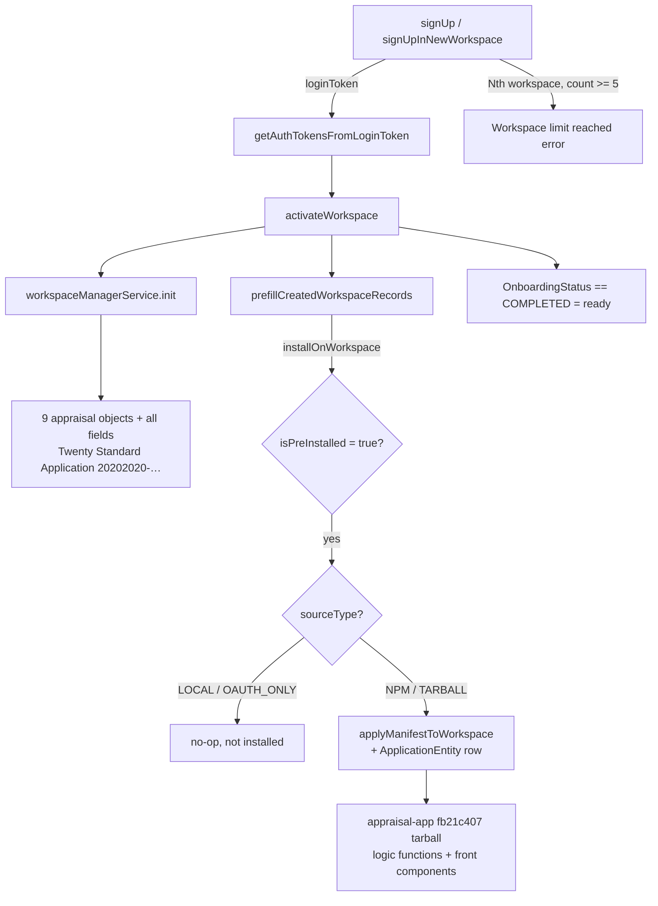

# docs.workspace-provisioning-preinstall — workspace sign-up/activation flow, pre-installed-app install, workspace cap

<!--dxWSPROV00001:init-->
## Scope and summary

Covers three tightly coupled `core-modules` flows: (1) how a fresh workspace is
provisioned from sign-up to "ready" (the auth mutation chain plus the computed
onboarding status machine), (2) what a fresh workspace is seeded with at
activation — the 9 appraisal-domain objects (via Standard-app init) and the
auto-installed pre-installed apps (the `installOnWorkspace` hook, the
`sourceType` gate, and how the appraisal-app installs as a `tarball` /
`isPreInstalled` registration), and (3) the hardcoded community-edition
5-workspace cap. It does NOT cover the rest of `core-modules` (billing, files,
i18n, ...), nor the appraisal object/field inventory (see the fork's
standard-application docs for that).

Key facts at a glance:

- Provisioning = `signUp`/`signUpInNewWorkspace` → `getAuthTokensFromLoginToken`
  → `activateWorkspace`; activation flips `PENDING_CREATION → ONGOING_CREATION →
  ACTIVE` and is the single hook that seeds the schema and installs
  pre-installed apps.
- "Ready" is the computed `OnboardingStatus === COMPLETED` — it is derived per
  request, never stored.
- The 9 appraisal-domain objects (`appraisal`, `property`, `compsearch`,
  `comparable`, `report`, `artifact`, `reportSection`, `reportNode`,
  `reportNodeEdge`) and all their fields are seeded by
  `workspaceManagerService.init` as part of the **Twenty Standard Application**
  (universalIdentifier `20202020-64aa-4b6f-b003-9c74b97cee20`) — verified on a
  fresh-provisioned workspace. They are NOT contributed by the appraisal-app.
- Pre-install iterates `applicationRegistration` rows with `isPreInstalled=true`
  and installs each, no-opping only `sourceType` `LOCAL` and `OAUTH_ONLY`. The
  appraisal-app (`fb21c407-9f44-4726-a5a3-5e3d68ac8377`) is registered as
  `sourceType=tarball` + `isPreInstalled=true`, so it auto-installs on every
  fresh workspace (contributing its logic functions + front components).
- The workspace cap is a hardcoded constant (5); only a valid enterprise key
  bypasses it, and deleted workspaces drop out of the count.

<!--/dxWSPROV00001:init-->

<!--dxWSPROV00002:OSE#1&ONB#64-->
## Onboarding status machine — computed, not stored

`OnboardingStatus` is a 7-value enum (OSE#1-9): `PLAN_REQUIRED`,
`WORKSPACE_ACTIVATION`, `PROFILE_CREATION`, `SYNC_EMAIL`, `APPS_INSTALLATION`,
`INVITE_TEAM`, `COMPLETED`. There is no persisted onboarding column —
`getOnboardingStatus` (ONB#64) recomputes the value on every request, resolving
states in priority order:

1. `WORKSPACE_ACTIVATION` while the workspace `activationStatus` is still
   `PENDING_CREATION`/`ONGOING_CREATION` (ONB#84).
2. Per-user `userVars` flags then gate `SYNC_EMAIL`, `APPS_INSTALLATION`,
   `PROFILE_CREATION`, `INVITE_TEAM` (each an onboarding screen the user
   completes or skips).
3. `PLAN_REQUIRED` for billing (ONB#127).
4. Otherwise `COMPLETED` (ONB#130) — **this is the "workspace is ready/usable"
   signal**. Tests should poll for `onboardingStatus === COMPLETED` (or assert
   the UI has left the onboarding routes) rather than sleeping.
<!--/dxWSPROV00002:OSE#1&ONB#64-->

<!--dxWSPROV00003:ARS#395&WSR#117&WSS#332-->
## Provisioning flow — auth mutation chain and workspace activation

GraphQL auth surface (all in `auth.resolver.ts`): `checkUserExists` (ARS#152),
`getLoginTokenFromCredentials` (ARS#193), `signIn` (ARS#228), `signUp` (ARS#395,
workspace-agnostic first sign-up), `signUpInWorkspace` (ARS#449, join an
existing workspace), `checkWorkspaceSubdomainAvailability` (ARS#523),
`getWorkspaceCreationDefaults` (ARS#531), **`signUpInNewWorkspace`** (ARS#543 —
creates a new workspace for an already-authenticated user and returns a
`loginToken` plus the new workspace's `workspaceUrls`, i.e. the `<slug>`
redirect target), and `getAuthTokensFromLoginToken` (ARS#624), which exchanges
the login token for access/refresh tokens in the new workspace's context.

Activation is the pivot: the `activateWorkspace` mutation (WSR#117) delegates to
`WorkspaceService.activateWorkspace` (WSS#332), which locks the workspace
through `PENDING_CREATION → ONGOING_CREATION → ACTIVE` and, inside the guarded
block (WSS#388-407):

1. `workspaceManagerService.init` — seeds the workspace schema, including all 9
   fork Standard-app objects (`appraisal`, `property`, `compsearch`,
   `comparable`, `report`, `artifact`, `reportSection`, `reportNode`,
   `reportNodeEdge`) with every field. This is the sole source of those objects
   on a fresh workspace — they belong to the Twenty Standard Application
   (`20202020-…`), not to the appraisal-app.
2. `featureFlagService.enableFeatureFlags` with the defaults.
3. `userWorkspaceService.createWorkspaceMember`.
4. **`prefillCreatedWorkspaceRecords`** (called WSS#400, defined WSS#865) — the
   pre-install hook, see next chunk.
5. `activateAndInitializeUpgradeState`.

On any error the workspace is reset to `PENDING_CREATION`, so a half-activated
workspace re-runs the whole init on retry.
<!--/dxWSPROV00003:ARS#395&WSR#117&WSS#332-->

<!--dxWSPROV00004:WSS#865&PIA#28&AIS#86&SRT#3-->
## Pre-installed-app install — trigger point and the sourceType gate

**A fresh workspace prefills no demo data.** `prefillCreatedWorkspaceRecords`
(WSS#865) documents (WSS#871-876) that no demo records are prefilled — only the
"create company when adding a new person" logic function is seeded, and then
`preInstalledAppsService.installOnWorkspace(workspaceId)` is awaited (WSS#885)
inside a try/catch: a pre-install failure is logged as non-critical and never
blocks activation. (The 9 appraisal objects themselves come from Standard-app
init, dxWSPROV00003 — not from this hook.)

**Mechanism** (`pre-installed-apps.service.ts`): `installOnWorkspace` (PIA#28)
queries `ApplicationRegistrationEntity WHERE isPreInstalled = true` (PIA#30) and
installs each registration via `applicationInstallService.installApplication`,
per-app cache-locked and fanned out with `Promise.allSettled` (PIA#37) so one
failing app cannot block the others. `isPreInstalled` is a **DB column on the
registration row** (set by SQL/deploy tooling), NOT a manifest field.

**The sourceType gate.** `application-install.service.ts` no-ops any registration
whose `sourceType === ApplicationRegistrationSourceType.LOCAL` (AIS#86-93 — logs
"Skipping install for LOCAL app ... (files synced by CLI watcher in dev mode)"
at AIS#89 and returns success), and likewise `OAUTH_ONLY` (AIS#96-104).
`sourceType` values (SRT#3-8): `NPM='npm'`, `TARBALL='tarball'`, `LOCAL='local'`,
`OAUTH_ONLY='oauth-only'`. So a registration auto-installs iff
`isPreInstalled=true` **AND** `sourceType ∈ {NPM, TARBALL}`. `TARBALL`
registrations get an extra owner check in `doInstallApplication` (AIS#145-160):
an unlisted, non-pre-installed tarball is installable only by its owner
workspace — but `isPreInstalled=true` exempts it, so a pre-installed tarball
installs into every workspace.

**The appraisal-app** (`universalIdentifier`
`fb21c407-9f44-4726-a5a3-5e3d68ac8377`, display "Appraisal") is registered as
`sourceType=tarball` with `isPreInstalled=true`, so it **auto-installs on every
fresh workspace** at activation. Its manifest declares `"objects": []` /
`"fields": []` — it contributes logic functions (the `appraisal-status-*`
pipeline triggers, `compsearch-created-mkdir`, `report-route`) plus front
components and a default function role, not objects. Current gap: the published
tarball is missing the logic-function source files, so install logs 6 warnings
of the form `Source file not found in package: src/logic-functions/…; skipping`
— the app row and its metadata migration land, but those functions are absent
until the tarball is repackaged with its sources.

**Verifying an install:** an installed app is an `ApplicationEntity` row keyed
by `universalIdentifier` + `workspaceId`, created by `ensureApplicationExists`
(AIS#711, called from the manifest-apply path at AIS#297). The CLI
`src/database/commands/install-pre-installed-apps.command.ts` (41 lines) is
only the idempotent **backfill** for pre-existing workspaces — the new-workspace
path is activation itself.
<!--/dxWSPROV00004:WSS#865&PIA#28&AIS#86&SRT#3-->

<!--dxWSPROV00005:SIU#527&MWC#1-->
## The 5-workspace cap (community edition)

`MAX_WORKSPACES_WITHOUT_ENTERPRISE_KEY = 5` is a hardcoded constant (MWC#1) —
there is no config variable to raise it. Enforcement lives in
`sign-in-up.service.ts`: `signUpOnNewWorkspace` (SIU#547) calls
`assertWorkspaceCreationAllowed` (SIU#489, invoked at SIU#566) →
`assertWorkspaceCountWithinLimit` (SIU#527). The check (SIU#534-543): a valid
enterprise key returns early; otherwise `workspaceCount < 5` must hold or an
`AuthException` (FORBIDDEN) is thrown with user-facing message **"Workspace
limit reached. A valid enterprise key is required to create more workspaces."**

The count is `workspaceRepository.count()`, which excludes deleted rows — so
either a soft-delete (`UPDATE core.workspace SET "deletedAt"=now()`) or a full
hard-delete of the row frees a slot. Sign-up gating: `isSignUpEnabled` (SIU#463)
allows new-workspace sign-up only when multi-workspace is enabled or zero
workspaces exist yet.
<!--/dxWSPROV00005:SIU#527&MWC#1-->

<!--dxWSPROV00006:CFG#1761&CFG#1011-->
## Runtime/stack facts and test guidance

Code defaults are single-workspace: `IS_MULTIWORKSPACE_ENABLED = false`
(CFG#1761) and `DEFAULT_SUBDOMAIN = 'app'` (CFG#1011, only validated when
multiworkspace is on, CFG#1010). The fork Docker stack (outer-repo
`docker-compose.yml`) overrides these: `IS_MULTIWORKSPACE_ENABLED=true`,
`DEFAULT_SUBDOMAIN=app`, port bind `38473:3000`. Therefore the login/sign-up
portal is `http://app.localhost:38473` and each workspace is served at
`<slug>.localhost:38473` (browsers resolve `*.localhost` to `127.0.0.1`;
non-browser clients must target `localhost:38473` with an explicit host
header).

For an E2E/smoke test of this flow (as the `tests/smoke-test` suite does):

- Drive `signUp`/`signUpInNewWorkspace` → `getAuthTokensFromLoginToken` →
  `activateWorkspace` (or the equivalent UI screens), then poll
  `onboardingStatus` for `COMPLETED` — never fixed sleeps.
- Assert "appraisal-app auto-installed on a fresh workspace" directly: the
  installed `ApplicationEntity` row for `fb21c407-…` must exist, and all 9
  Standard-app objects must be present with every field (smoke AC-2 does exactly
  this and passes on a freshly provisioned workspace).
- Use unique slugs/emails per run and **hard-delete** created workspaces in
  teardown — `DROP SCHEMA "workspace_<base36(id)>" CASCADE` + `DELETE FROM
  core.workspace` (every FK into `core.workspace` is `ON DELETE CASCADE`/`SET
  NULL`). A soft-delete frees the 5-cap but LEAKS the workspace schema; hundreds
  of leaked `workspace_*` schemas bloat the pg catalog until `activateWorkspace`
  trips a Postgres query-read timeout (`INTERNAL_SERVER_ERROR: Query read
  timeout`). Drop orphan schemas one-per-autocommit-statement (a single
  transaction dropping many → `out of shared memory`).
- Provisioning is heavy (~17-25s: Standard-app init + tarball app install + SDK
  client generation) and memory-hungry. On the fork Docker stack the `server`
  container is capped at 2 GiB and one activation costs ~280 MiB, so two
  concurrent activations can OOM-restart it (`ECONNRESET`) — run provisioning
  specs with a single worker and a per-test timeout ≥ 60s.
<!--/dxWSPROV00006:CFG#1761&CFG#1011-->
